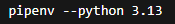
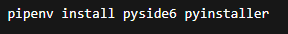
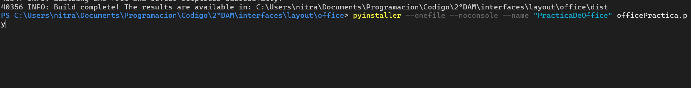

# Mini Word 📝

Aplicación de escritorio hecha con **Python** y **PySide6** que simula un editor de texto sencillo (tipo bloc de notas mejorado) con búsqueda avanzada, paneles laterales y modo oscuro.

## 🧱 Características principales

- **Ventana principal** con título “Mini Word”.
- **Área de texto central** (`QTextEdit`) para escribir y editar contenido.
- **Barra de menús**:
  - **Archivo**: Nuevo, Abrir, Guardar, Salir.
  - **Editar**: Deshacer, Rehacer, Copiar, Cortar, Pegar.
  - **Estilo**: Cambiar color de fondo, cambiar color de fuente, cambiar fuente y **Modo oscuro**.
- **Barra de herramientas** con los botones más usados (nuevo, abrir, guardar, deshacer, rehacer, copiar, cortar, pegar, mostrar panel de búsqueda y mostrar panel de reemplazo).
- **Barra de estado** con:
  - contador de palabras en la parte izquierda,
  - mensajes de acción/opciones en la parte derecha.

## 🔍 Búsqueda y reemplazo avanzados

Además del típico `Ctrl+F`, la app tiene **paneles laterales (QDockWidget)** a la derecha para gestionar la búsqueda y el reemplazo sin ventanas emergentes:

- Panel **Buscar**:
  - escribir el texto a buscar
  - ir a **siguiente** coincidencia
  - ir a **anterior** coincidencia
  - **buscar todas** (resalta todas las coincidencias en el documento)
- Panel **Reemplazar**:
  - texto a buscar
  - texto por el que se reemplaza
  - **reemplazar siguiente**
  - **reemplazar todos**

Los paneles se pueden mostrar/ocultar desde la barra de herramientas o el menú.

## 🎨 Personalización

- Cambiar **color de fondo** del área de texto.
- Cambiar **color de fuente** del texto.
- Cambiar **tipo de letra** con un diálogo de fuentes.
- **Modo oscuro / modo claro** con un solo clic (se cambia el `stylesheet` de toda la ventana).

## 📊 Contador de palabras

Cada vez que el usuario escribe, en la barra de estado aparece:

```text
Palabras: X
Se actualiza automáticamente con el evento textChanged.

📁 Gestión de archivos
Nuevo: limpia el editor.

Abrir: abre un archivo de texto desde el disco y lo carga en el QTextEdit.

Guardar: guarda el contenido actual del editor en un archivo elegido por el usuario.

Salir: cierra la aplicación.

⌨️ Atajos de teclado
Ctrl + N → Nuevo

Ctrl + O → Abrir

Ctrl + S → Guardar

Ctrl + Q → Salir

Ctrl + Z → Deshacer

Ctrl + Y → Rehacer

Ctrl + C → Copiar

Ctrl + X → Cortar

Ctrl + V → Pegar

Ctrl + F → Buscar

Ctrl + R → Reemplazar

F3 → Siguiente coincidencia

Shift + F3 → Anterior coincidencia

📦 Requisitos
Python 3.9+ (o similar)

PySide6

Instalación de la dependencia:

bash
Copiar código
pip install PySide6
▶️ Ejecución
Coloca el archivo .py en tu proyecto.

Crea una carpeta imagenes/ al lado del script con los iconos:

nuevo.png

abrir.png

guardar.png

salir.png

deshacer.png

rehacer.png

copiar.png

cortar.png

pegar.png

buscar.png

reemplazar.png

Ejecuta:

bash
Copiar código
python mini_word.py
(cambia el nombre por el que le hayas puesto al archivo)

🧩 Estructura del código
Ventana (QMainWindow): clase principal.

QTextEdit central: editor de texto.

QToolBar: acciones rápidas.

QDockWidget (Buscar / Reemplazar): paneles laterales para controlar el comportamiento de búsqueda.

QStatusBar: mensajes + contador de palabras.

Funciones de estilo: cambio de colores, fuentes y modo oscuro.

✅ Funcionalidades extra implementadas
Panel de búsqueda y reemplazo acoplable a la derecha (mejora lo que pide la práctica).

Modo oscuro para darle un toque más actual.

Mensajes contextuales en la barra de estado.

Íconos personalizados cargados desde una carpeta imagenes.
## Pasos para generar el ejecutable (con capturas)

1. Instalar `pipx` para aislar herramientas de CLI: `python -m pip install --user pipx`  
   
2. Asegurar que `pipx` quede en el PATH: `python -m pipx ensurepath`  
   
3. Instalar `pipenv` con `pipx`: `pipx install pipenv`  
   
4. Crear el entorno virtual con Python 3.13: `pipenv --python 3.13`  
   
5. Instalar dependencias para la app y el empaquetado: `pipenv install pyside6 pyinstaller`  
   
6. Generar el ejecutable con PyInstaller: `pyinstaller --onefile --noconsole --name "PracticaDeOffice" officePractica.py`  
   

El ejecutable final aparece en `dist/PracticaDeOffice.exe` junto con los archivos de soporte que PyInstaller copie.

