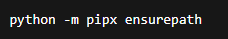
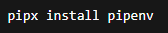
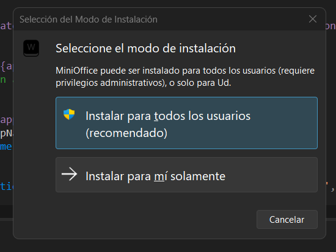

# Mini Word

Aplicacion de escritorio en **Python** y **PySide6** que simula un editor de texto sencillo (bloc de notas mejorado) con busqueda avanzada, paneles laterales y modo oscuro.

## Caracteristicas principales

- Ventana principal con el titulo "Mini Word".
- Area de texto central (`QTextEdit`) para escribir y editar contenido.
- Barra de menus:
  - Archivo: Nuevo, Abrir, Guardar, Salir.
  - Editar: Deshacer, Rehacer, Copiar, Cortar, Pegar.
  - Estilo: Cambiar color de fondo, cambiar color de fuente, cambiar fuente y modo oscuro.
- Barra de herramientas con los botones mas usados (nuevo, abrir, guardar, deshacer, rehacer, copiar, cortar, pegar, mostrar panel de busqueda y mostrar panel de reemplazo).
- Barra de estado con el contador de palabras a la izquierda y mensajes a la derecha.

## Busqueda y reemplazo avanzados

Ademas del tipico `Ctrl+F`, la app tiene paneles laterales (`QDockWidget`) a la derecha para gestionar busqueda y reemplazo sin ventanas emergentes:

- Panel Buscar: texto a buscar, siguiente, anterior, buscar todas (resalta coincidencias).
- Panel Reemplazar: texto a buscar, texto por el que se reemplaza, reemplazar siguiente, reemplazar todos.

Los paneles se pueden mostrar u ocultar desde la barra de herramientas o el menu.

## Personalizacion

- Cambiar color de fondo del area de texto.
- Cambiar color de fuente del texto.
- Cambiar tipo de letra con dialogo de fuentes.
- Modo oscuro / claro con un clic (se cambia el `stylesheet` de toda la ventana).

## Contador de palabras

El contador se actualiza con cada `textChanged` y muestra en la barra de estado:

```text
Palabras: X
```

## Gestion de archivos

- Nuevo: limpia el editor.
- Abrir: carga un archivo de texto en el `QTextEdit`.
- Guardar: guarda el contenido actual en disco.
- Salir: cierra la aplicacion.

## Atajos de teclado

- `Ctrl+N`: Nuevo
- `Ctrl+O`: Abrir
- `Ctrl+S`: Guardar
- `Ctrl+Q`: Salir
- `Ctrl+Z`: Deshacer
- `Ctrl+Y`: Rehacer
- `Ctrl+C`: Copiar
- `Ctrl+X`: Cortar
- `Ctrl+V`: Pegar
- `Ctrl+F`: Buscar
- `Ctrl+R`: Reemplazar
- `F3`: Siguiente coincidencia
- `Shift+F3`: Anterior coincidencia

## Requisitos

- Python 3.9+
- PySide6 (`pip install PySide6`)

## Ejecucion

1. Coloca el archivo `officePractica.py` en tu proyecto.
2. Crea una carpeta `imagenes/` al lado del script con los iconos: `nuevo.png`, `abrir.png`, `guardar.png`, `salir.png`, `deshacer.png`, `rehacer.png`, `copiar.png`, `cortar.png`, `pegar.png`, `buscar.png`, `reemplazar.png`.
3. Ejecuta:  
   ```bash
   python officePractica.py
   ```

## Estructura del codigo

- `QMainWindow`: ventana principal.
- `QTextEdit`: editor central.
- `QToolBar`: acciones rapidas.
- `QDockWidget` (Buscar / Reemplazar): paneles laterales de busqueda.
- `QStatusBar`: mensajes y contador de palabras.
- Funciones de estilo: cambio de colores, fuentes y modo oscuro.

## Funcionalidades extra

- Panel de busqueda y reemplazo acoplable a la derecha.
- Modo oscuro.
- Mensajes contextuales en la barra de estado.
- Iconos personalizados cargados desde `imagenes/`.

## Pasos para generar el ejecutable (con capturas)

1. Instalar `pipx` para aislar herramientas de CLI:  
   `python -m pip install --user pipx`  
   
2. Asegurar que `pipx` queda en el PATH:  
   `python -m pipx ensurepath`  
   
3. Instalar `pipenv` con `pipx`:  
   `pipx install pipenv`  
   
4. Crear el entorno virtual con Python 3.13:  
   `pipenv --python 3.13`  
   
5. Instalar dependencias para la app y el empaquetado:  
   `pipenv install pyside6 pyinstaller`  
   
6. Generar el ejecutable con PyInstaller desde el entorno:  
   `pyinstaller --onefile --noconsole --name "PracticaDeOffice" officePractica.py`  
   

El ejecutable final aparece en `dist/PracticaDeOffice.exe`.

## Crear el instalador (Inno Setup)

1. Asegurate de tener el `dist/PracticaDeOffice.exe` generado por PyInstaller.
2. Abre `Instalador.iss` en Inno Setup y revisa nombre de app, version, icono (`imagenes/iconoApp.ico`) y licencia (`docs/LICENSE.txt`).  
   
3. Compila el script (Build -> Compile). Inno Setup generara el instalador `Output/MiniOfficeSetup.exe` usando el ejecutable que apuntes en la seccion `[Files]`.  
   
4. Ejecuta `Output/MiniOfficeSetup.exe` para probar la instalacion de MiniOffice.  
   
5. Si cambias la version o el nombre de la app, actualiza `MyAppVersion` y `MyAppName` al inicio de `Instalador.iss` antes de compilar.
6. Si necesitas incluir archivos extra (p. ej. README o docs), anadelos en la seccion `[Files]` apuntando a su ruta dentro del proyecto.
7. Puedes personalizar el grupo de accesos directos (seccion `[Icons]`) o desactivar el icono de escritorio editando la tarea `desktopicon` en `[Tasks]`.
